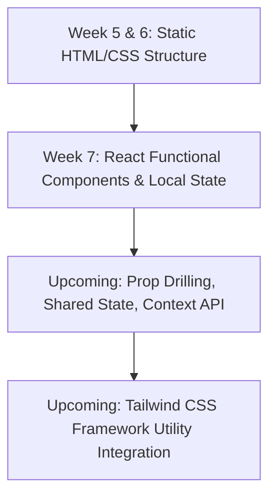

```markdown
# Suntech Assignments - Week 7: Core React Fundamentals & Stateful UI Architecture

Welcome to the documentation for **Week 7 (react-handson-1)**. Having mastered semantic HTML grids, fluid layouts, and CSS engines over the past weeks, this assignment marks our transition into **Modern JavaScript Frameworks**. We shifted from static markup files into building a high-performance, single-page web application (SPA) powered by **React** and bundled using **Vite**.

The focus of this project is moving away from manual DOM manipulation (like `document.getElementById`) to adopt a declarative, component-driven UI pattern utilizing reactive state systems.

---

## 📂 Project Directory Structure

The workspace follows standard modern React boilerplates, splitting global public assets from highly decoupled, reusable functional components:

```text
react-handson-1/
├── public/             # Static multi-media assets and raw graphic files
├── src/                # Core React Application Source Code
│   ├── assets/         # Project-specific local styles, layouts, or images
│   ├── components/     # Reusable, atomic UI functional view elements
│   ├── App.jsx         # Root Component coordinating layout views and states
│   └── main.jsx        # Single Application Entry Point (Mounts React to the DOM)
├── .gitignore          # Prevents tracking node_modules/ and build outputs
├── eslint.config.js    # Strict static code analysis and linting rules
├── index.html          # Single anchor page shell containing the root mounting div
├── package.json        # Build scripts, project metadata, and dependency tree
└── vite.config.js      # Ultra-fast bundler parameters and asset path mappings

```

---

## 🛠️ The Developer Toolkit (Commands & Workflow)

Transitioning to modern Single Page Applications introduces a build-step workflow. We use the Node Package Manager (`npm`) to handle project lifecycles, dev-server compilation, and code quality assurance.

### Critical Terminal Scripts & Lifecycles

* **Initialize and Install Workspace Dependencies:**
Run this command after cloning or pulling the project down to build your local `node_modules` catalog:
```bash
npm install

```


* **Spin Up the Hot-Module-Replacement (HMR) Dev Server:**
Launches the hyper-fast Vite development engine. Code changes compile instantly in memory and reflect in the browser without full page refreshes:
```bash
npm run dev

```


*Once running, navigate your browser interface to standard network port mapping: `http://localhost:5173`.*
* **Run Strict Linting Code Quality Audits:**
Uses ESLint to scan your syntax files for potential bugs, dead code blocks, or broken rule mappings before deploying code:
```bash
npm run lint

```


* **Compile a Production-Optimized Distribution Build:**
Bundles, minifies, and tree-shakes your React architecture down into dense, highly performant vanilla assets inside a static `/dist` directory for cloud hosting:
```bash
npm run build

```


---

## 🧠 What We Learned & Implemented

### 1. From Imperative to Declarative UI Programming

* **The Old Way (Week 5 & 6):** Creating elements, targeting selectors manually, updating strings, and pushing them into layouts step-by-step.
* **The React Way (Week 7):** Declaring how the user interface should look based on the current data state. React watches for changes and automatically manages updates behind the scenes using its Virtual DOM engine.

### 2. Component Isolation & Reusability

* Broke complex user layouts down into separate, modular, self-contained functional components.
* Mastered the concept of structural element composition—nesting child component fragments cleanly inside parent wrappers to establish a clear data flow.

### 3. Dynamic State Management (`useState`)

* Implemented React's core reactive hook (`useState`) to preserve local data tracking states directly across active components.
* Bound state mutation utilities to responsive user interface controls (e.g., handling form text inputs, managing button toggle clicks, or tracking active selections).

### 4. Code Quality Standards with Modern Bundlers

* Configured modern **Vite** configuration pipes for lightning-fast asset loading and bundling compared to traditional legacy bundlers.
* Applied strict structural linting policies through custom `eslint.config.js` matrices to ensure clean, consistent, and error-free JavaScript execution profiles.

---

## 🗺️ Roadmap: Navigating the Frontend Lifecycle

This project forms the baseline logic tier for dynamic client-side application design, establishing the foundation needed before integrating global state pipelines or advanced styling suites:



```
***

```